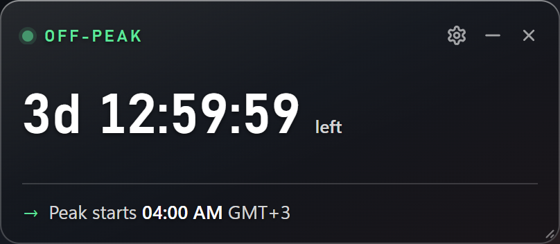
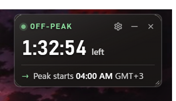
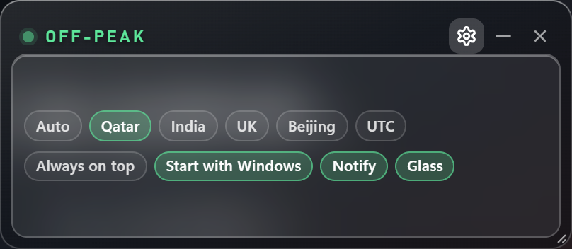
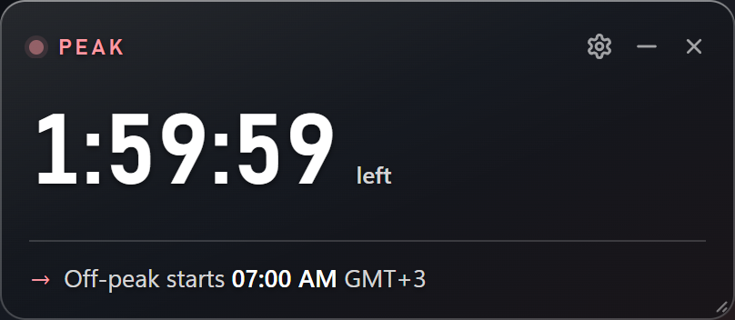

# DeepSeek Peak / Off-Peak — a desktop countdown widget

A tiny always-there card for Windows that answers one question: **is DeepSeek
charging peak or off-peak rates right now, and how long is left?**



Off-peak is half price, so the difference between "send it now" and "send it in
an hour" is real money. The widget is a countdown, not a dashboard: the current
rate, the time left in it, and when the next change happens in your timezone.

And here it is as a real window — the blur behind the glass is Windows' acrylic,
which only exists on the desktop:



* **Transparent glass** — the desktop shows through it; the card itself is a
  colourless shade with white text. It thickens slightly when it sits over a
  bright window so the text stays readable, and it goes solid dark if you switch
  the glass off (without the blur there is nothing to be transparent with).
* **Stays on the desktop** — it lives on the wallpaper and stays there when you
  show the desktop (Win+D or the three-finger swipe), but goes behind your
  windows when you get back to work. **Always on top** is a switch, not a
  requirement.
* **Out of the way** — no taskbar button, no Alt+Tab entry, draggable anywhere,
  resizable down to 200 × 84, position and size remembered.
* **No API key, no network** — it never calls DeepSeek. The pricing rule is
  implemented locally, and Chinese public holidays ship as a small data file.
* Peak/off-peak changes raise a Windows notification (optional), and it can start
  with Windows (optional).

## When it's peak, and what it costs

Straight from [DeepSeek's pricing page](https://api-docs.deepseek.com/quick_start/pricing):

> Off-peak rates are half of the peak rates. Peak hours are 01:00 - 04:00 and
> 06:00 - 10:00 UTC, Monday through Friday, excluding Chinese public holidays.
> All other hours are off-peak, including weekends and Chinese public holidays
> in full.

So the two peak windows each weekday are **01:00–04:00 UTC** and
**06:00–10:00 UTC** — everything else, weekends and holidays included, is
off-peak at half price. Prices per 1M tokens (USD, at the time of writing):

| | deepseek-flash peak | off-peak | deepseek-v4-pro peak | off-peak |
| --- | --- | --- | --- | --- |
| input, cache hit | $0.006 | $0.003 | $0.044 | $0.022 |
| input, cache miss | $0.30 | $0.15 | $1.32 | $0.66 |
| output | $1.20 | $0.60 | $3.96 | $1.98 |

Prices change — treat that table as a snapshot and check the page. The real
payload of this widget is the *rule* above, which is what the countdown is built
on. Windows are anchored to UTC, so your timezone only changes the labels.

## Install

Windows 10/11 with Edge WebView2 (already part of Windows). Needs Python 3.11+
and ~15 seconds:

```bat
git clone https://github.com/Hamras47/deepseek-peaktime-monitor-widget.git
cd deepseek-peaktime-monitor-widget
python -m venv .venv
.venv\Scripts\python.exe -m pip install -r requirements.txt
run.cmd
```

`run.cmd` starts it with no console window; `run-debug.cmd` keeps a console and
opens devtools, and writes everything to `widget.log`. Right-click the **tray
icon** for *Show / hide*, *Stay on desktop*, *Start with Windows* and *Quit*.

## Options

Everything else hides behind the gear so the card stays a countdown:



Timezone chips and four switches — Always on top, Start with Windows, Notify,
Glass. The chips are named by their standard abbreviation rather than a country,
and the tooltip gives the full name:

| chip | timezone | offset |
| --- | --- | --- |
| Auto | whatever Windows is set to | — |
| AST | Arabian Standard Time | UTC+3 |
| IST | Indian Standard Time | UTC+5:30 |
| GMT | Greenwich Mean Time (BST in summer) | UTC+0 / +1 |
| UTC+8 | UTC+8, no daylight saving | UTC+8 |
| UTC | Coordinated Universal Time | UTC+0 |

Preferences, position and size live in `config.json` next to the app.



## Notes

* The countdown is driven by the app, not by the page, so it keeps running while
  the card sits behind other windows — Windows throttles and then freezes a covered
  window's own timers, which used to leave a stale number on the card.
* The holiday list is generated from the official Chinese government papers by
  `tools/build_holidays.py`; rerun it when a new year is published.
* `app.py --ui-test` drives the real window through its whole interactive surface
  (switches, move, resize, show-desktop, taskbar flags) and reports PASS/FAIL to
  `widget.log`; the pricing engine has its own tests in `tests/`.
* The how-and-why — renderer quirks, the glass, that Windows has no way to sit
  "just above" the desktop, and every trap hit along the way, is in
  [`docs/internals.md`](docs/internals.md).
